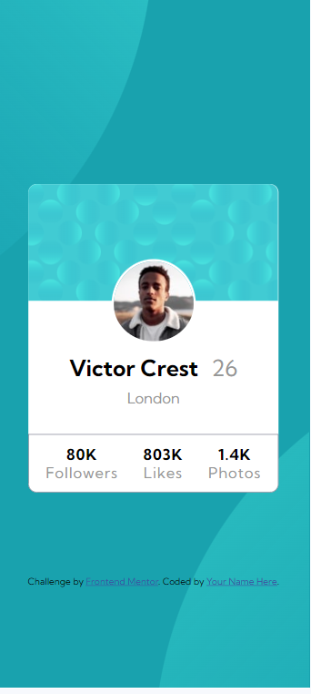
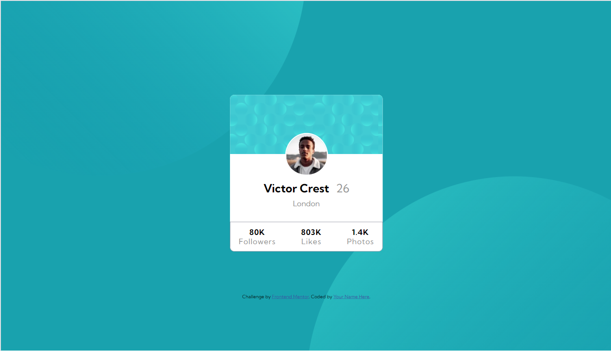

# Frontend Mentor - Profile card component solution

This is a solution to the [Profile card component challenge on Frontend Mentor](https://www.frontendmentor.io/challenges/profile-card-component-cfArpWshJ). Frontend Mentor challenges help you improve your coding skills by building realistic projects. 

## Table of contents

- [Overview](#overview)
  - [The challenge](#the-challenge)
  - [Screenshot](#screenshot)
  - [Links](#links)
- [My process](#my-process)
  - [Built with](#built-with)
  - [Useful resources](#useful-resources)
- [Author](#author)

## Overview

### The challenge

- Build out the project to the designs provided

### Screenshot

 

### Links

- Solution URL: (https://github.com/Emmyk-17/profile-card)
- Live Site URL: [Add live site URL here](https://your-live-site-url.com)

## My process

### Built with

- Semantic HTML5 markup
- Flexbox
- Mobile-first workflow

### Useful resources

- [Example resource 1](https://www.W3school.com) - This helped me for CSS. I really liked this pattern used to make cards there.

## Author

- Website - [Emmanuel](https://github.com/Emmyk-17)
- Frontend Mentor - [@Emmyk-17](https://www.frontendmentor.io/profile/Emmyk-17)
